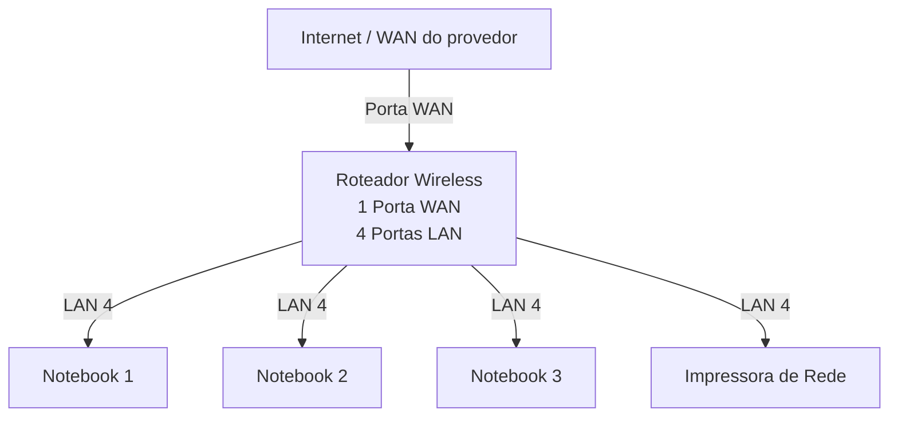

# Laboratório de Redes 1 - Projeto de Rede local

Aluno: Nicolas Matheus Ribeiro Lopes

Professor: José de Assis

Data: 09/03/2026

---

## **1. Objetivo:**
Implementar uma rede local simples conectando 3 notbooks a um roteador wireless com switch e uma impressora de rede.

O projeto será dividido em 2 etapas:

1. Simulação da Rede no Cisco Packet Tracer
2. Implementação da rede no laboratório real

---

## **2. Equipamentos usados nesse laboratpório:**

- 3 Notebooks
- 1 Roteador Wireless com 1 porta WAN e 4 portas LAN
- 1 Impressora de rede
- Cabos de rede

---

## **3. Topologia da Rede:**

Diagrama lógico da rede usada neste laboratório. 

Imagem da topologia usada neste laboratório:

