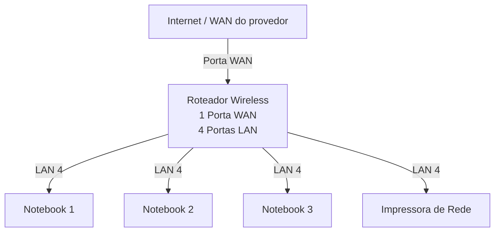
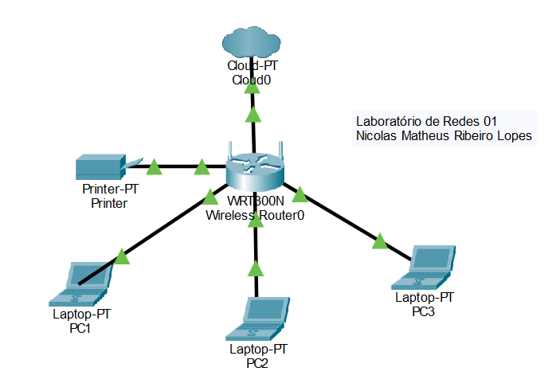

# Laboratório de Redes 1 - Projeto de Rede local

Aluno: Nicolas Matheus Ribeiro Lopes

Professor: José de Assis

Data: 09/03/2026

---

## **1. Objetivo:**
Implementar uma rede local simples conectando 3 notbooks a um roteador wireless com switch e uma impressora de rede.

O projeto será dividido em 2 etapas:

1. Simulação da Rede no Cisco Packet Tracer
2. Implementação da rede no laboratório real

---

## **2. Equipamentos usados nesse laboratório:**

- 3 Notebooks
- 1 Roteador Wireless com 1 porta WAN e 4 portas LAN
- 1 Impressora de rede
- Cabos de rede

---

## **3. Topologia da Rede:**

Diagrama lógico da rede usada neste laboratório. 

  <strong>Imagem da topologia usada neste laboratório:</strong>  
  

---

## **4. Plano de endereçamento IP:**

Rede : 192.168.0.0/24

Gateway: 192.168.0.1

| Dispositivo | Tipo de IP | Ednereço IP | Observação |
|-------------|-------------|-------------|-------------|
| Roteador | Estático | 192.168.0.1 | IP do roteador |
| Impressora | Reserva DHCP | 192.168.0.102 | IP reservado pelo roteador |
| PC1 | Reserva DHCP | 192.168.0.105 | IP reservado pelo roteador |
| PC2 | DHCP | Automático | IP atribuído pelo roteador |
| PC3 | DHCP | Automático | IP atribuído pelo roteador |

**Observação**

- A impressora e um dos notebooks utilizam reserva DHCP.
- O roteador sempre atribui o mesmo endereço IP a esses dispositivos.

---

## **5. Implementação do laboratório real:**

Após a instalação, a rede foi montada fisicamente no laboratório.

Etapas realizadas:

(fotos e capturas de tela realizadas durante o laboratório)

Testes:

(fotos e capturas de tela realizadas durante o laboratório)

---

## **6. Conclusão:**

Este laboratório permitiu compreender o funcionamento de uma rede local simples, incluindo:

- Estrutura de uma rede doméstica ou de pequeno escritório (rede local)
- Utilização de um roteador com porta WAN e portas LAN
- Funcionamento do DHCP
- Comunicação entre dispositivos na rede local 
- Utilização de uma impressora de rede 
- Compartilhamento de pasta na rede usando Windows 
- Jogos em redes locais
